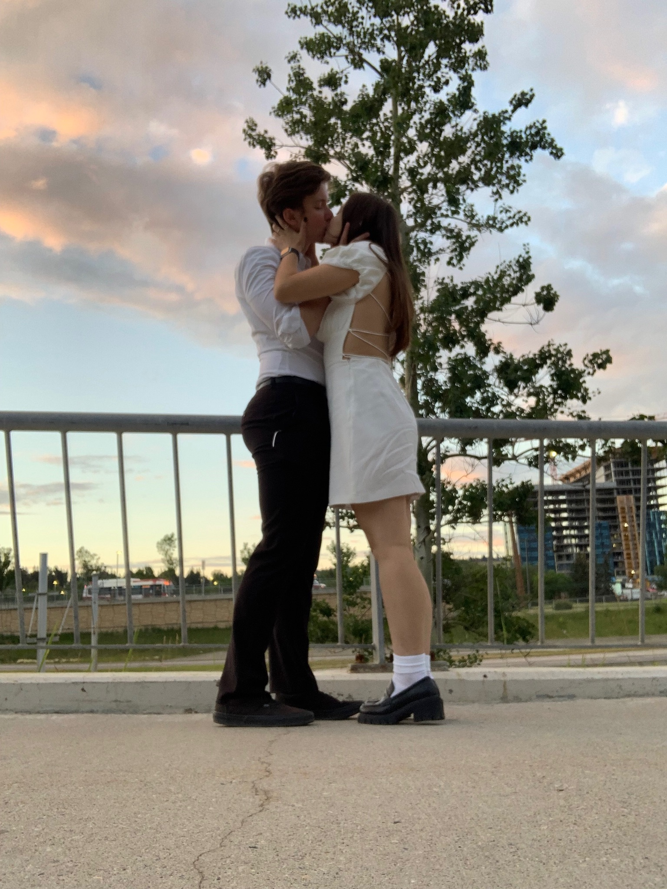

<html lang="en">
<head>
  <meta charset="UTF-8">
  <meta name="viewport" content="width=device-width, initial-scale=1.0">
  
</head>
<h1 style="text-align: center;">Joyeuse Saint-Valentin!</h1>

  

Merci beaucoup pour avoir été ma <i>magnifique</i> girlfriend pendant aussi longtemps. J'aime toujours passer du temps avec toi, faire des activités et entendre tes petites blagues.

Veux-tu être ma <b>Valentine?</b>

<a href="Oui.jpg">Oui</a>

<a href="Non.jpg">Non</a>

</html>
